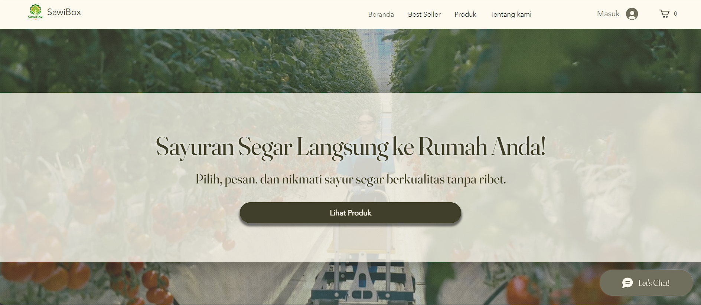
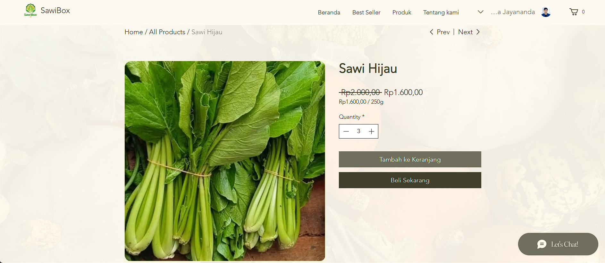

    
    <table>
    <tr>
    <td></td>
    <td><h1>SawiBox</h1></td>
    </tr>
    </table>
    
     
    <em> Made possible by: </em>
     
    
    

---

**SawiBox** adalah sebuah website yang memungkinkan pengguna untuk membeli sayur-mayur segar langsung dari petani lokal terpercaya. 

Kami berkomitmen untuk menyediakan hasil pertanian berkualitas melalui dukungan terhadap pertanian lokal dan upaya keberlanjutan.

## Daftar Isi

1. [Daftar Isi](#daftar-isi)
2. [Fitur](#fitur)
3. [Tech Stack](#tech-stack)
4. [Lampiran](#screenshot-tampilan-website)
    4.1. [Screenshot](#screenshot-tampilan-website)
    4.2. [Video](#video-demo)
    4.3. [Link Website](#akses-web)
    4.4. [Presentasi](#file-presentasi)
5. [Tim Pengembang](#tim-pengembang)

## Fitur
Kami memahami kebutuhan Anda akan kecepatan, kenyamanan, dan kualitas. 

Inilah fitur-fitur utama yang membuat belanja sayuran di SawiBox jadi pengalaman yang menyenangkan:
- 🛒 Katalog sayuran lengkap dengan foto dan harga.
- 🔍 Pencarian dan filter berdasarkan kategori (daun, buah, akar) untuk mempermudah.
- 🧺 Keranjang belanja dan sistem checkout sederhana.
- 📍 Pilih sendiri waktu pengiriman sesuai rutinitas Anda. Kami menjamin sayuran sampai segar dan tepat waktu, hingga ke depan pintu rumah Anda.
- 📬 Lihat ketersediaan sayur secara langsung di website! Tidak perlu khawatir kehabisan — data kami terupdate secara otomatis setiap waktu.

## Tech Stack
Website ini dikembangkan menggunakan platform website-builder **[Wix](https://www.wix.com)** untuk memenuhi kebutuhan klien secara efisien dan cepat.

Pemilihan metode ini memungkinkan pembuatan tampilan profesional tanpa perlu coding kompleks, sehingga sangat cocok untuk proyek dengan deadline ketat dan kebutuhan visual yang jelas.

**Alasan penggunaan:**
- 📂 Database yang mudah untuk dimodifikasi
- ⏱️ Efisiensi waktu pengerjaan
- 🎨 Fokus pada desain dan kemudahan navigasi
- 📱 Pengembangan UI responsif yang cepat untuk desktop dan mobile

## Screenshot Tampilan Website

  
  
  
  
  

## Video Demo
Klik gambar di bawah untuk menonton video demo kami di YouTube.

  

## Akses Web

atau

Klik link berikut ini: **https://schryzon.wixsite.com/sawibox**

## File Presentasi
Klik gambar di bawah untuk membuka file presentasi kami di Canva.

  

## Tim Pengembang
- **I Nyoman Windia Sedana** - Digital Business
- **Mahriadi** - Digital Business
- **I Nyoman Widiyasa Jayananda** - Programmer ([Schryzon](https://github.com/Schryzon))
- **M. Sagos** - Programmer ([gasosart](https://github.com/Sagos4321))

Kontributor Repo

 

   

---

[![][back-to-top]](#top)

[back-to-top]: https://img.shields.io/badge/-BACK_TO_TOP-151515?style=flat-square